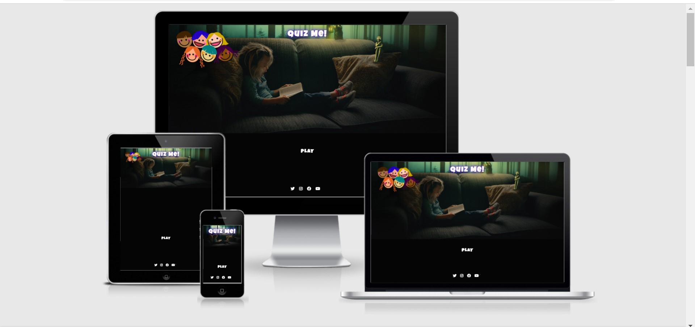
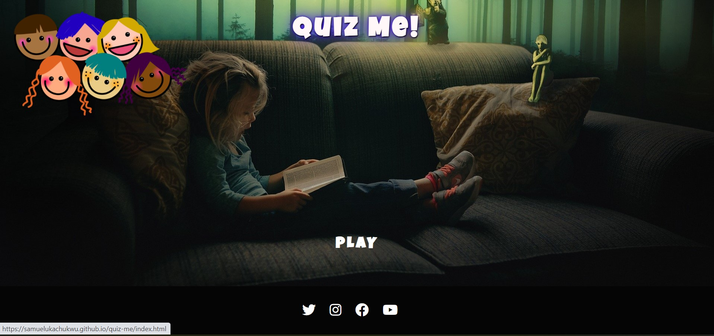
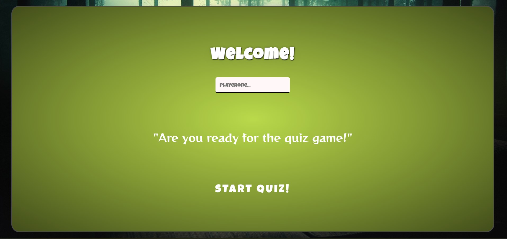
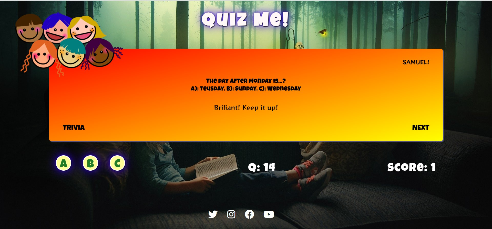
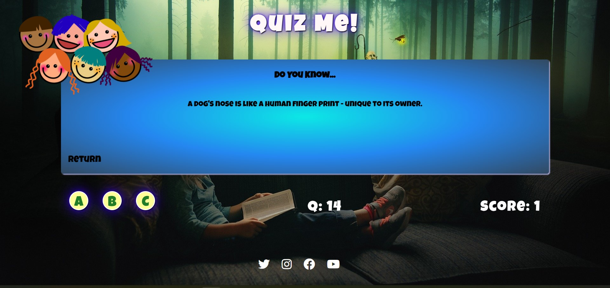
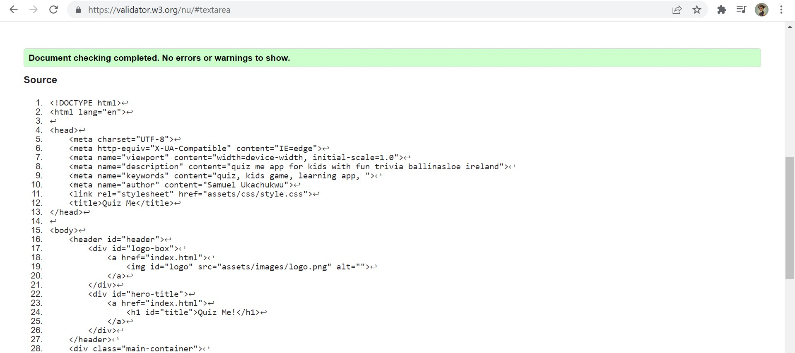
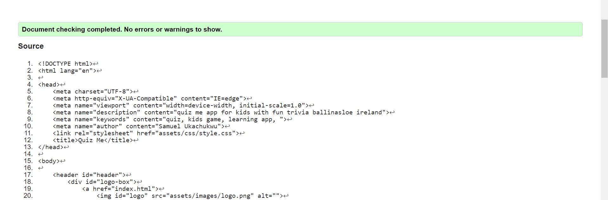
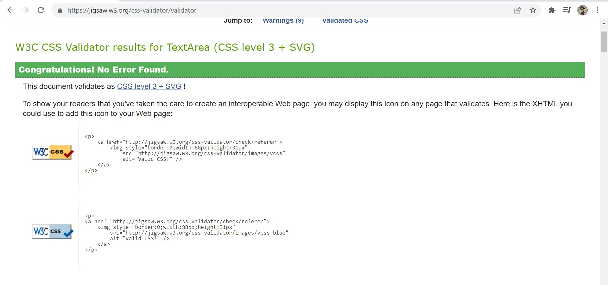
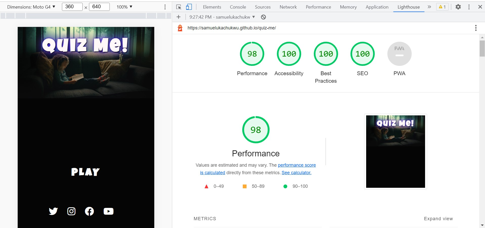

# QUIZ ME 

## 

The QUIZ ME is an application designed to give kids an educative moment of fun answering daily to random question and also it offers informative facts on trivial issues around the world. it is designed with the age bracket of 7 years and up wards but adults are sure to find it engaging too.  

users of the app are requested to create a user name and engage in answering 15 random questions receiving a score at the end of the session.

## Features:

**Navigation:**

1.	the site is designed to be as simple as possible as the target users age bracket would allow. images with links to refresh the page back to the home page serves as the navigation. 

2.	the middle of the page is a single link assigned "play" this link when clicked takes the user to the game page

3. The hero image is a static background image well suited for the dark theme of the site and allow users much sight friendly screen time.   
4. Below the play button is the footer and offers site users a link to the social media pages and more exploration.
links open in new browser tabs.

 **Game Area:**

1. The Register page allows users to choose and enter a player name. captured usernames are displayed on the game screen personalizing users' engagement on the site.

2. The game is a simple quiz game where the player is asked a question and feedback is inputted using the three option keys. Player's answers are displayed in the middle. a question score counter is visible to the player and on selecting the 'NEXT' key feedback of score, question left and if the player got the question correct is giving. 

3. A trivia card with fun facts is hidden behind the game area and each click offers a random message.

## Features Left to Implement
the following feature are missing from the site and i would love to implement them in the future.
1. Color coding for wrong and right answers. Green = correct answers. Red = wrong answers.

2. navigation link to other mini games example a link to a maths game or trivia game.
 

## Testing:
I tested that the page works in different browsers Chrome, Mozilla Firefox and Microsoft edge 

I have confirmed that all links work perfectly and all navigation elements are easy to read and understand.

Responsiveness test on each web browser was done using the developer device tool bar.

## Bugs: 
none found.

## Validator Testing 
**HTML**

No errors were returned when each html page was passed through the official W3C validator.

**CSS**

No errors were returned when the css stylesheet was passed through the official (jigsaw) validator.

No warnings returned when the javascript was passed through the JSHint JavaScript Validator

**Accessibility**

Accessibility testing was conducted using light house devtools and it confirmed that the fonts and colors selected are easy to read and accecssible.

**Unfixed bugs:** 

none

## Deployment 

The site was deployed to github pages using the following steps:
1.	In the github repository click on the setting tab 
2.	Navigate to the github pages section and click on the dedicated pages tab
3.	On the source tab select main and save
4.	Once the branch main is saved the page displays a link to the website.
5.	Refresh the browser and a: _Your site is published at_ display with the site link appears. 

The live site can be found here [QUIZ ME]( https://samuelukachukwu.github.io/quiz-me/)

## Credits

### Media

Images used in the website:
images used in the site are from (https://pixabay.com/)
*  [StockSnap](https://pixabay.com/photos/kid-people-girl-child-sitting-2603857/)
*	[Prawny](https://pixabay.com/users/prawny-162579/)

### Content

* Site triva facts are from [goodto](https://www.goodto.com/family/facts-for-kids-5446)
* Social buttons and Lotus image in header are from [Font Awesome](https://fontawesome.com/)

### Inserted Codes

* Fisher-Yates Code for Random Array Shuffle.

 * [Shawn Steward](https://stackoverflow.com/users/186116/shawn-steward) for codes in radio button reset.

