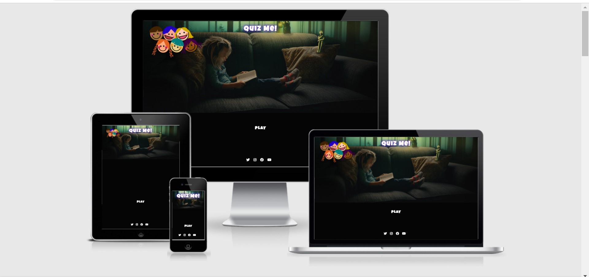
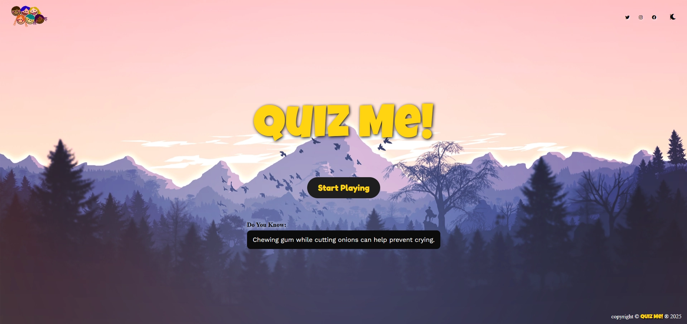
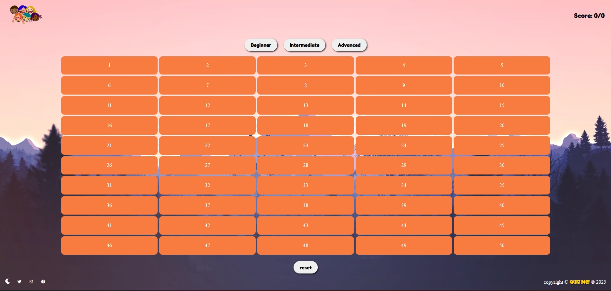
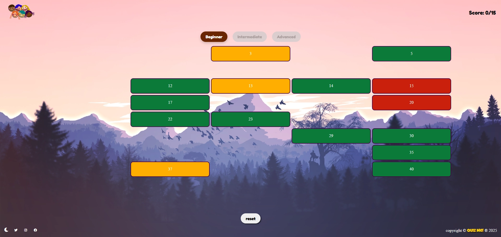
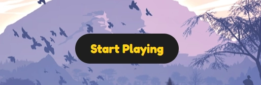
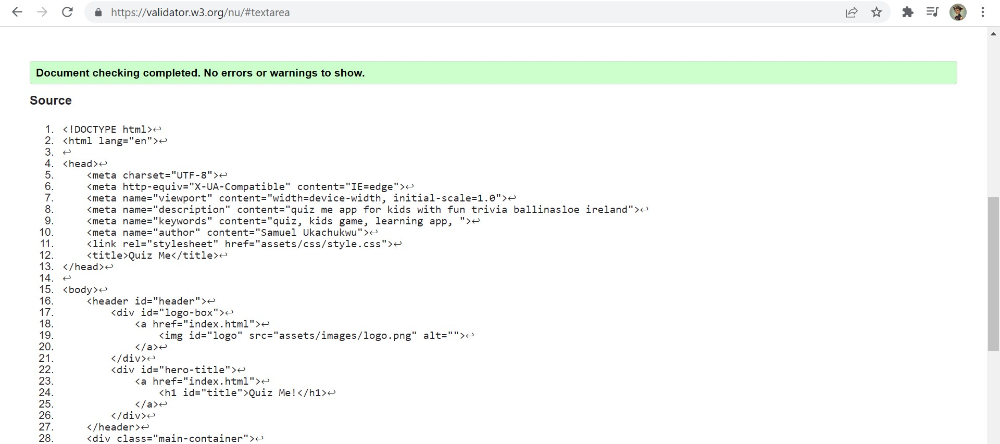
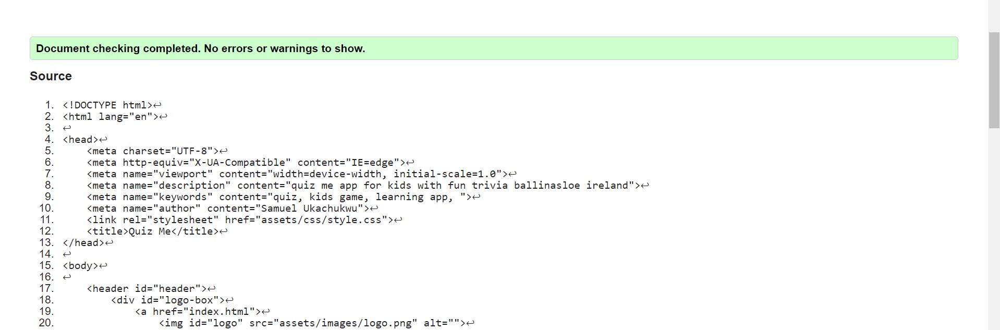
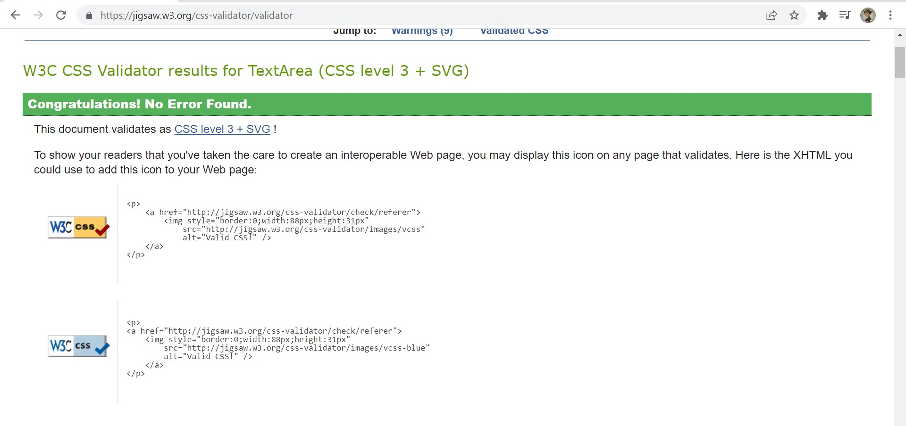
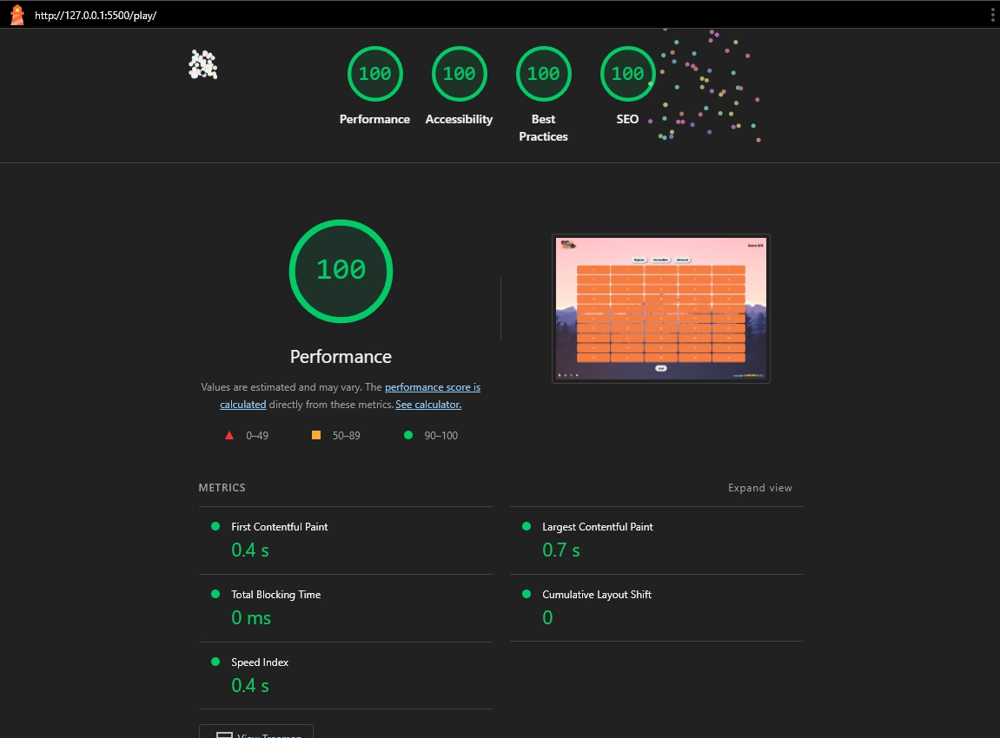

# QUIZ ME 

## 

The QUIZ ME is an application designed to give kids an educative moment of fun answering questions in a random fashion and also it offers informative trivia card with random "Do you know..." facts from around the world. it is designed with the age bracket of 7 years and up wards but adults are sure to find it engaging too.  

users of the app are requested to create a user name and engage in answering 15 random questions receiving a score at the end of the session.

## Features:

### 🎮 Game Mechanics

- **Difficulty Levels**:
  - **Beginner**: 15 questions (10 easy, 3 medium, 2 hard)
  - **Intermediate**: 20 questions (5 easy, 10 medium, 5 hard)
  - **Advanced**: 30 questions (5 easy, 10 medium, 15 hard)

- **Question Shuffling**:
  - Uses Fisher-Yates Shuffle to randomize both questions and option order for each session.

- **Block Grid**:
  - 50 clickable blocks are rendered.
  - Randomly assigned blocks contain quiz questions.
  - Block color indicates difficulty:
    - 🟢 Green: Easy
    - 🟠 Orange: Medium
    - 🔴 Red: Hard

- **Question Modal**:
  - Opens on clicking a question block.
  - Displays one question with shuffled options.
  - Users choose one answer and submit.

- **Live Scoreboard**:
  - Score updates after each question.
  - Displays final score once all questions are completed.

- **Reset Button**:
  - Resets the entire game state: difficulty, score, and questions.

### ✨ Visual Feedback

- **Confetti Animation**:
  - On answering, animated message and sparkles show correctness.
  - `Correct!` or `Incorrect!` message with glowing effect.

- **Final Score Modal**:
  - Displays final score in animated format.
  - Includes a reset button to restart the quiz.

---

## Screenshots

### Home & Navigation

### Register & Ready Page

### Game Area

### Trivia Card (Optional Future Feature)

## Features Left to Implement
the following feature are missing from the site and i would love to implement them in the future.

- [ ] Sound effects for correct and incorrect answers.
- [ ] Trivia card feature re-integration after each question.
- [ ] Additional mini-games (e.g., Math Quiz, Spelling Game).
- [ ] Accessibility enhancements (keyboard navigation, screen reader labels).
 

## Testing

- ✅ Tested on:
  - Google Chrome
  - Mozilla Firefox
  - Microsoft Edge

- ✅ All buttons, form inputs, and blocks tested for functionality.
- ✅ Responsive layout tested using browser developer tools and [ami.responsivedesign.is](https://ami.responsivedesign.is).

---

## Bugs

- No major bugs found.

---

## Validator Testing 
**HTML**

No errors were returned when each html page was passed through the official W3C validator.

**CSS**

No errors were returned when the css stylesheet was passed through the official (jigsaw) validator.

No warnings returned when the javascript was passed through the JSHint JavaScript Validator [JSHint](https://jshint.com/)

**Accessibility**

Accessibility testing was conducted using light house devtools and it confirmed that the fonts and colors selected are easy to read and accessible.

**Unfixed bugs:** 

none

## Deployment 

The site was deployed to github pages using the following steps:
1.	In the github repository click on the setting tab 
2.	Navigate to the github pages section and click on the dedicated pages tab
3.	On the source tab select main and save
4.	Once the branch main is saved the page displays a link to the website.
5.	Refresh the browser and a: _Your site is published at_ display with the site link appears. 

The live site can be found here [QUIZ ME]( https://samuelukachukwu.github.io/quiz-me/)

## Credits

### Media

Images used in the website:
images used in the site are from (https://pixabay.com/)
*  [StockSnap](https://pixabay.com/photos/kid-people-girl-child-sitting-2603857/)
*	[Prawny](https://pixabay.com/users/prawny-162579/)

### Content

* Site triva facts are from [goodto](https://www.goodto.com/family/facts-for-kids-5446)
* questions from [funquizzes](https://www.funquizzes.uk/kids-quiz-questions/)
* Social buttons and Lotus image in header are from [Font Awesome](https://fontawesome.com/)

### Inserted Codes

* Fisher-Yates Code for Random Array Shuffle.

 * [Shawn Steward](https://stackoverflow.com/users/186116/shawn-steward) for codes in radio button reset.

---

## Summary

**QUIZ ME** has evolved into a full-featured quiz app with interactive visuals, adaptive difficulty, and engaging animations. It’s educational, accessible, and perfect for casual learning.

> “Learning should never be boring—QUIZ ME proves it can be fun!”

